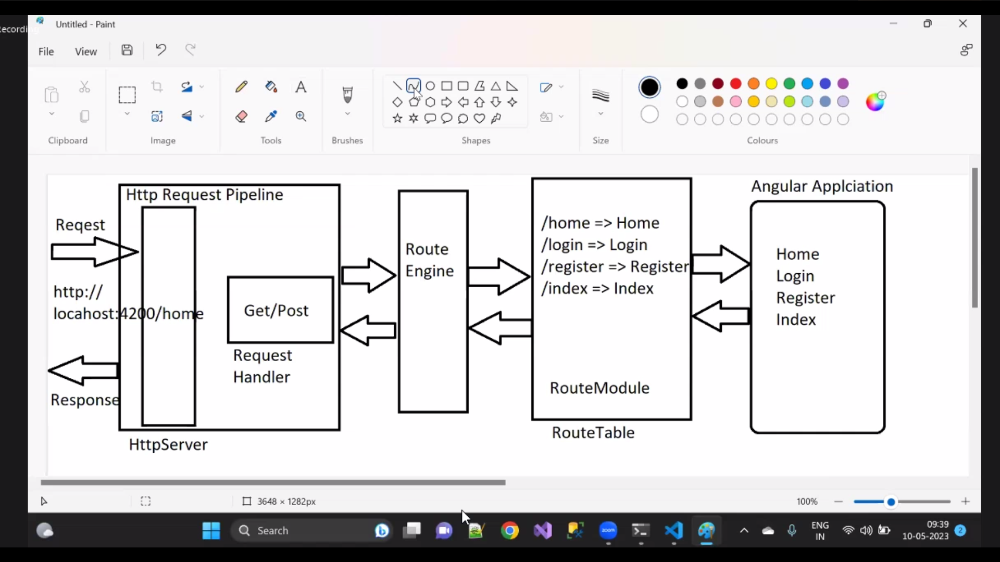

# Angular

- npm install -g @angular/cli

- components
    - selector  
        - ex:  in html the selectors are <h1>,div,span,img,p  - pre-define

- ng new TaskMan --no-standalone --routing --ssr-false or ng new taskM --no-standalone --routing

- ng new my-angular-app
- ng serve

- npm install -g typescript

# Topic
- > Introducation Angular
- > Setup the Evironment
- > Typescript
- > Creatin abgular15 App and Folder and file structure
- > Templets,style,Directives
- > Components
- > Data Binding
- > Pipes
- > Services => Integration (API Calls + AJAX)
- > Dependency Injection
- > Angular Forms
- > Routing (SPA) along with Authentication
- > RxJS Operators & Observables
- > MOdules
- > Version Enhancements
- > Source code of simple Project on Angular (JWT) 

# Environment Setup for building Angular Application
- Node JS

# angular application developement
- Creating Angular application
- Steps to create 
    -   install node js will install npm also
    -   Install the typescript - npm install -g typescript
    -   install the IDE (VS)

    - Angular cli - command line interface which is used to create the deveolpe the build and deploy yje angular
    - by using Ang CLI, we are also to generate the components,directives , pipes,services etc. with scafflod options

    - When we do the first time installation 
    - > npm install -g @angular/cli
    - ng --version  - Check the angular version which was installed
    - If we have already installed, and we want to update the version
    - npm uninstall -g @angular/cli  - Uninstall the ang from system
    - npm cache verlfy     - Clear the cache

    - Npm install the latest versoion -  npm install -g @angular/cli

# How to create an angular application
- two ways
    - ng new <applicationnanme>

# By creating workspace
- Workspace provides a platform for handling multiple projects.
- It provides a global library or repository for handling multiple project at once
- ng new my-angular-workspace --createApplication=false

- ng new my-angular-workspace --no-create-application

# After creating a workspace , It will create following file system 
- 1 node_modules   : It contains all the libraries that are required to build angular application
- 2 tsconfig.json  : It configures the rules for typescript, and also it defines env for typescript to build angular application
- 3 package.json  : It contains the lib info of project
- 4 packegae-lock.json  :It contains metadata about every dependency that installed in project
- 5 angular.json  : It creates initial env for the workspace . here once we create an application it  automatically configures
Stylesheets, script files, test files

- 6 gitignore  : git is a SCM

- 7 .editorconfig  :  

# Angular application Execution Flow:
- 1 Create a workspace     > ng new <workspaceName> --no-create-application
- 2 create the project that we want to build  > ng generate application <appName>  
- 3 Execute the application   > ng serve --project=<appName>

Note: one we execute above command it will open/ the project will run on a port i.e  4200
        http://localhost:4200

4. Execution starts from
    index.html => <app-root></app-root> => component => (HTML+CSS)

# In Angular execution we have to consider two things
- UI    => index.html => <app-root></app-root> => component => (HTML+CSS)
- Business => main.ts => AppModule => AppComponent => index.html

- Babel uses AOT(Ahead Of Time) machineism, which is used to convert static DOM(Document Object Model) into Dynamic DOM, the process of converting is known as "bootstrapping"
- 

# Angular Project File System:
- Every project in angular is having a folder i.e. "src" which means it contains the source code to build the project.

- app: It contains the application resources to build the angular project like
    - modules
    - components
    - directives
    - services
    - pipes etc.

- assets: This folder contains static resources like image,text,pdf,word etc.

- index.html: It is the starting page for angular application
- main.ts: It is the entry point, from here application will get compile and process
- style.css: It is used to provide global styles for the angular components.

# Angular building blocks:
- Angular is a comp based framework or platform.
- Every angular application development must involve following things

    - Modules : Modules is used to improve the modularity for building angular application. a module will contains components, pipes, directives,services etc
    EX: NareshIT
        - Trainer
            - 3 pages
            - 1 form
        - Admin
        - HR
        - CourseSchedule

    - Factory : It is nothing pre-defined functions.
    - Services : Serviec is a collection factories.
    - Templates : It is a HTML. 
    - Pipes : It is used to transform the data.
    - Directives :  It is a speical components
    - Routing : SPA
    - Metadata : It contains information about What we are developing
    -

# Components in Angular:
- Component in angular is a basic building block to build angular applications.
- Every components is combination of 3 files
    - Presentation   - It is nothing design of the page, It can be implemented by using HTML, and we have file (*.component.html)
    - Styles  - These are used to provide good Graphical interface or Styles for the HTML tags. It can be implemented by using CSS/Bootstrap.
        - We have a file extension i.e *.component.css   
    - Business logic
        -  These are used to write business logic, like getting the data, submitting the data to the server, performing calculation etc
        - Here we have a file extension i.e *.component.ts

- A Component In Angular is a typescript class, which can be created with the help of @Component() decorator.- 
- Every building block of angular like comp, service, pipe,module ect is a typescript class, inorder to differentiate we use Decorators
- Component   - @Component()
- Services    - @Injectable()
- Module      - @NgModule()
- Pipes       - @Pipe()  etc.

- Decorator : A decorator in angular is used to differentiate the angular elements and it is used to maintain the metadata
- @Component() decorator is having following metadata like
    - selector: It is used to load the HTML
    - template: It is used to create the design
    - styles: it is used to provide structure we have two options

# To design/develop the above structure we have two options
    - Inline components
        - If we have HTML, CSS and Typescript all at one place or in one single file i.e Inline Components
        - We can reduce the number of requests to the server.
        - This machanism is not good for reusability, extension,testing

    - Code behind Components
        - Here we are going to implement by using diffirent files like
        UI    - component.html
        Styles    - component.css
        Logic    - component.ts

- To work with the component we use to follow below steps
    - Create a typescript class file and use @component() decorator.
    - Register the component in any one module(app.module.ts)
     declaration: [
        AppComponent,
        EmployeeComponent
     ]
    - Bootstrap the Component
        bootstrap: [EmployeeComponent]
    - Use the selector in index.html
        <body>
            <app-employee></app-employee>
        <body>
    - Execute the project
        > ng serve --project=ComponentsDemo

# Code Behind Components:
- in this technique we are creating HTML,CSS and Typescript files separatly
- 

Note: We are able to create components by using Angular CLI Command like
    > ng generate component Register

    aligs > ng g c netflixMain

    ng g c netflixRegister --skip-tests

Example with Multiple Components:
    - Create a folder in components folder "Netflix
    - Create the components
     NetflixHeader          -  > ng generate component NetflixHeader
     NetflixMain            -  > ng g c NetflixMain
     NetflixRegister        -  > ng g c NetflixRegister --skip-tests (This commonnd will remove the spec.ts file)
     NetflixIndex           -  > ng g c NetflixIndex --skip-tests 
     

# Data Binding in Angular:
- It is a technique which is used to bind the data with the UI.
- 
- Employee
 - Eno    -  101
 - Ename  -  Siru
 - JOB    -  Trainer

- It is used to access the data from data source and display in the UI(HTML), when user modify the value from UI, then it has to be updated back to the data source.

- In Javascript/JQuery to do the Data binding we use DOM(Document Object Model) Manupulations and Events etc. can be used and its is very difficult.
- In Angular to perform the DATA Binding we have two approches
    - MVC(Model - View - Controller)
    - MVVM(Model View - View Model)

facebook - JSP 
 - Insta reels on FB
 - 

- What is MVC and What is design pattern - A design pattern is solution for commenly addressing problems with existing technologies.

- MVC is a design pattern -  It was introduced in 1970s.
- It is mainly used for code seperation and also reusability concerns.
- MVC is used In various technologies
 JAVa    - Spring MVC
 php      - Code Igniter
 Python   - Django, Flask
 Ruby      - Ruby on Rails
 JS         - Angular, Spine

- Models are used to represent the data.
- View is used to present the data, In Angular upto 13 version we have "IVY" View engine was there, now from 14 and 15 we have
"Babel"
- Controller is used to define the application specific logic, and It is also used to handle the Incoming requests.
- Using MVC we Have two ways to do the data binding
 - One-Way Data Binding
  - It is the Process of getting the data from Model(Variable) and Binding With UI.
   - Interpolation Syntax  - {{}}
    - It is used the data binding expression like "{{}}"
    - it is used to bind the direct data to the HTML tags
    - But if we want to bind it to bind it to the properties of the HTML then it is not a good programming practice.
   - Property Binding      - []
    -   We can access any HTML element property by using property binding and assign the value dynamically.
    -   Here we can access only the properties which are the part of HTML
   - Attribute Binding     - []

   - What is the difference bt Property Binding and Attribute Binding?
    - Attributes are immutable, can't change according to state and situation.
    - Properties ar mutable, can change according to the state and situation.

    - EX.         => img.src         = [src]
    - <table height="400px">           => table.style.height     = [attr.height]

 - Two-Way Data Binding:
    # Attribute Binding:
        -    It allows to bind any dynamic value to the element attribute.
        - These attributes are defined by using "attr"
        - syntax:
            - [attr.attributeName] = "dynamicvalue"
             - <table [attr.height] = "tableHeight>

        Note:
        Above 3 machinisms like
         - Interpolation
         - Property Binding
         - Attribute Binding those are used to get the data from component to the template(html).
       -  But If we want to share the data from template to the component we use "Event Binding".

    -   () - Event Binding:
        -  When user Interacts the application in the form of a keyboard, mouse over, mouse out, click, dbl click, then internally It is called an action and that is technically an Event.
        - An Event is an action performed by the user.
        - When an evnet is happen we have to handle it with the help of event handlers, those are nothing but functions.
        - Example: mouse,keyboard,click,change,form etc.
        - In Javascript all event are supported in angular
        - In angular event Binding is represented with "()"

    - In JS : <button onclick="f1()">Click Me</Button>
    - In Angular : <button (click)="F1()">Click Me</button>
    -   [(ngModel)]

# Two-way Data Binding:
- It is used to modify the data , when user modifies in HTML template to the component and vice versa.
 - Template         <=>    component
- It is the combination of Attribute - [] and Event Binding - ()
- So that we are implementing two way data binding by using "[(ngModel)]".
- [(ngModel)] is pre-defined type which is availabel in "FormsModule"
- We can apply the [(ngModel)] only for form elements.

# Directives:
- Angular directives are used to change the behaviour and also used to add/remove the html elements at runtime.
- Directive which is also a typescript class, we use @Directive() to create it.
- we have 3 types of directives
    - Structural Directives
        - It is used to change the appearence of the DOM by adding or removing the HTML elements.
        - *ngIf, *ngFor, and  ngSwitch
    - Behavioural Directives
        - It is used to change the appearence by adding or removing the css styles.
        - [ngStyle] and [ngClass]
    - Component Directives
        - These are directives which comes with templates.
        - <app-login></app-login>

# *ngIf:
    -   It is a structural directive which will be used to add/remove based on the boolean value.
    - syntax:
     <element *ngif="true/fase"></element>
- *ngIF then:
- It is an alternative code block, which is used to display the content when condition returns false.
- Here else block can be represented with "theb".
- Syntax:     true/false
 - 

 -  <ng-template #thenBlock>
    ...HTML
    </ng-template>
    <ng-template #elseBlock>
    ...HTML
    </ng-template>

        # Run the project
        - ng s -o --project=DirectivesDemo

# Content-Projection:
- It is a technique where templates are configured explicitly and renders into the component according to the conditions.
- Issue is creating and rendering dynamically will take more time
- To overcome above issue we use "NgSwitch".

# NgSwitch:
- Here we can define more template in UI.
- And also content-projection is not required.
- NgSwitch can select the template that matches the given condition and also renders in UI.
 - ngSwitch
 - ngSwitchCase
 - ngSwitchDefault

- syntax:
 - <parent [ngSwitch] = "condition">
        <childcontainer *ngSwitchCase="case1">HTML</childContainer>
                <childcontainer *ngSwitchCase="case1">HTML<childContainer>
                        <childcontainer *ngSwitchCase="case2">HTML<childContainer>
                                <childcontainer *ngSwitchCase="case2">HTML</childContainer>
                <childcontainer *ngSwitchCase="case3">HTML</childContainer>                        
    <parent>

# *ngFor:
 
- It is a repeater, used to repeat any HTML element based on the collection.
- Internallay *ngFor directive is using for..of
- It will iterate the elements based on the collection items;
    - 
{{item}}

- var courses = ["c#.net","asp.net core","angular","reactjs"];
  - c#.Net        - courses[0]
  - ASP.Net core  - courses[1]
  - Angular       - courses[2]
  - ReactJS       - courses[3]

- for..of: It is uses to get the values
- for..in: It is used to get the key (index)

- for(var item of courses){
    <li>item</li>
}
- for(var item in courses){
    <li>courses[item]</li>
}

# Fetching the data from online API endpoints and display with *ngFor:
- Inorder to fetch the data from the API endpoint, we use a method i.e fetch() from Javascript.
- Syntax is:
 - fetch('url')  / api for the get request
  .then(response=>response.json())
  .then(data=>console.log(data))

# *ngFor Properties:
- *ngFor is used to generate the HTML dynamically based on the collection items
- Syntax:
 - 

# Property           type       Description
- Index              number     It returns the index of the repeting element.
- first              boolean    It true, if the repeating element is first element.
- last               boolean    it true, if the repeating element is last element
- even               boolean    it true , if the repeating element is an even element
- odd                boolean    it true , if the repeating elemnet is an odd element.

# - trackBy()          function    It tracks the changes for the collection and iterate only those changes

EmpID   Ename     Salary
101     Srikanth  12345
102     Raju      28394

[GetData] => Get the updated data

EmpID     Ename     Salary
101       Srikanth   12839
102       Raju       28398
103       Bhanu      78983

# 25  -------------------------------------------------------------------------
- Creating Angular application without workspace workspace:
 - To create an application without workspace we use following commands
 - ng new ShoppingPage
 - npm install bootstrap --save
 - npm install bootstrap-icons --save

 - GET                      /products                       It return an array of products
 - GET                      /products/1                     it return single product details based on ID in JSON format
 - GET                      /products/categories            it returns all thecategories in string[] format
 - GET                      /products/category/jewelery     it returns the products that are belongs to perticular category

 - create a contract class based on api response

 - export interface ProductInfo {
    id:number;
    title:string;
    price:number;
    desc:string;
    category:string;
    image:string;
    rating:{
        rate:number;
        count:number
    }
 }

 app.componnet.ts

 app.componet.html

# -------------------------------------------------------------------------
# Directives
- # Structural    : Which will add/remove the HTML at runtime. Examples: *ngIf, *ngFor and ngSwitch
- # Attribute/Behavioural : These are used to change the behaviour like styles at runtime, Examples: [ngStyle] and [ngClass].
- # Components  : These are also directives which will be accessed with selector, which contains a template(HTML)

- [NgClass]
 - It is used to apply the styles/css  classes dynamically to any element.
 - We can apply styles in 3 Ways
    - using String
    - using an Array
    - using an Object

- Syntax:
 

 

 

# [ngStyle] / Style Binding:

 - It is used to apply the css style properties to the HTML elements dynamically.
 - These are defines the inline styles for the HTML elements
    - Inline       

    - Internal     Here we use style tag and apply the style.
    - External     Here we create a seperate CSS file, and define the styles

- The limitation is it is not more reusable and also it is faster in rendering.
- Syntax:
    

    public emp = {
        empID:number,
        empName:string
    };

    emp={
        empId=101,
        empName:"Srikanth"
    }

# ----------------------------------------------------------------------------------------

# Event binding:
- An event is nothing but an action performed by the user.
- When user perform an action then we will have to handle It by using "EventHandler.
- An Eventhandler is a function that responds when user perform an action.
- <button (click)="Demo()"></button>        => Sender
- function Demo(){
-     //Logic                                 => Subscribed/Handles
- } 

- Angular supports all the events that are available in JavaScript.

# Events:
-  1 Mouse Events
-  2 keyboard
-  3 Button
-  4 Element State Events
-  5 Clipboard Events
-  6 TimerEvents etc.

# Note $ event:
 - Angular allows a default argument i.e "$event", Which is used to get the reference of complete object from where the event has been fired.

 - 

    
 - 

 - function F1(e:any){
    e.target.id
    e.target.name
    e.target.className

    //logic

 }

# [Creatinng inside workspace an appilcation] = ng generate application EventBinding

# start the Application = ng serve --project=EventBinding 

# [Creating inside an component] = ng g c MouseEvent --skip-tests

# -------------------------------------------------------------------------------------

- Event              Event Handler
 -  click           -> Login()
 -  change          -> ChangeCategory()
 -  mouseover       -> F1()
 -  mousemove
 -  keyup
 -  keypress

# [Pipes] :

- A Pipe is a Function, which is used to transform the values, while displaying in UI(HTML)
- It is mainly used to transform the format of the data.
- We can have two types
 - Built-in
    - uppercase         : It is used to convert all the strings in uppercase
    - lowercase         : It is used to convert all the strings in lowercase
    - titlecase
    - number
    - currency
    - date  
        - short
        - long
        - full
        - shortDate
        - longDate
        - dd
        - MM
        - yy etc.
    - json
    - slice
    - i18Select
    - percent
    - i18nPlural etc.

 - Custom : If above pipes are not meet our requirements then we will create a custom pipe.

- Pipes can be applied with interpolation syntax
- Syntax:
 {{property  | pipe}}
 
  - # ng g application PipesDemo 
  - # ng serve --project=PipesDemo
  - # ng g c PipesDemo --skip-tests

# - Custom Pipes:
 - It is a class, which is created with @Pipe() decorator.
 - Every Pipe class must be inherited from "PipeTransform".
 - PipeTransform interface is having on menthod i.e "transform()".
 - # To generate pipe by using Angular CLI we use a command i.e "ng g pipe <name>".
 - Once we create the pipe it has to registerd in Module under declaration section.
 -

- # @Pipe({
-    name:"pipename"
- })

- export class PipeClass implements PipeTransform{
    transform(value,options){

    }
}

- <h1>{{empName | pipename:'emp':'name'}}</h1>

# ----------------------------------------------------------------------------------------------------------------------

# Custom Directives:
- Structural:
    -   Which is used to add/remove the HTML dynamically.
    -   *ngIf, *ngFor, *NgSwitch
- Behavioural
    - Which is used to add/remove the CSS classes and styles dynamically.
    - [ngStyle] nad [ngClass]
- Component
    - If the above directives are not meet the requirements then we can have a custom directive and implement the custome logic and we use.
    - A custom directive is a class is decorated with @Directive().

 - # ng g c CustomDir
 - # ng generate directive CustomDir --skip-tests

# -----------------------------------------------------------------------------------------------------

# Services in Angular:
- [Login]             ----      [     ]
- [Registration]      ----      [OPT()]
- [Payments]          ----      [     ]

  Component                 Services

- # A Service is a reusable class, which will be created with the help of @Injectable() decorator.
- It contains pre-defined business logic, which can be used across the application whenever it requires.
- Advantages:
    - Reusability
    - Security
    - Testability
    - Maintaince
    - Extensibility

- Service is a set of factories.
- Factory is set of functions
- Angular services are using "Singleton" machanism, which means the object of the service is created in very first request and can be used across the application.
- # Angular services uses DI.(Dependency Injection)
    - Providers
    - Injectors
- Provider is responsible for locating the values or functions from the memory.
- Injector will inject the functions and values used into the component.
- We have built in services like
    - HttpClient
    - Routing
    - Security etc.

- To create a service in angular we use a command "ng generate service <servName>4
- # ng generate application ServiceDemo
- # ng s --project=ServiceDemo
- # ng g service otp --skip-tests

# ------------------------------------------------------------------------------------------------
# What are the various provider locations for a service?
@Injectable({
    provideIn:'root'
})

- Here provideIn is used to specify the access of the service.
- root      :  refers to current application level
- platform  :  It refers the current module level.
- any       :  It refers the workspace level.

# Component Communication:
- Angular is madeup with the help components.
- Share the data from one component to another component we use 3 machanism.
    - @Input()
    - @Output()
    - Services

- # Whenever we want to transfer the data from parent to child we use @Input()
    - import {input} from '@angular/cli'
    - @Input() public msgFromParent:string="message";

- @Input() is a marker/decorator Which is used to mark any property that is expecting the data from the parent component.
- Once we have the data from parent component we are sending it to the child by using property binding "[]"

- <app-child [msgFromParent]="message"></app-child>

- ng g c Child --skip-tests
- ng g c Parent --skip-tests

- <>
- 

    

- 

- Parent to Child   data transform

- # Step-1 : Declare a property in child compoenent by using @Input()
- # Step-2 : Prepare the data from parent component
- # Step-3 : Give the data by using child selector and attribute/property binding

# From the Child we will transfer the data to the parent by using @Output()

- Create a custom event when we are working with Output() decorator.
- EventEmitter is a class which is used to create a custom event.

- @Output() public ChildClick:EventEmitter<string> = new EventEmitter<string>();

- Emit the value by using event
- public ButtonClick(){
    this.ChildClick.emit("Srikanth");
}

- In Child component select use the custom event
    - <app-child (ChildClick)="GetMessageFromChild()"></app-child>

-  Event handler will get the data and that can be bind in Parent 
- public GetMessageFromChild(){
-     this.msg = e.value;
- }

import { CommonModule } from '@angular/common';
import { Component, EventEmitter, Input, Output } from '@angular/core';

@Component({
  selector: 'app-child',
  standalone: true,
  imports: [CommonModule],
  templateUrl: './child.component.html',
  styleUrl: './child.component.css'
})
export class ChildComponent {
  @Input() public msgFromParent:string = '';
  @Input() public studentObj:any[]=[];

  @Output() public ChildClick:EventEmitter<string> = new EventEmitter<string>();

  public ChildButtonClick(){
    this.ChildClick.emit('Hello ! from Child');
    
  }

}

import { Component } from '@angular/core';
import { ChildComponent } from "../child/child.component";

@Component({
  selector: 'app-parent',
  standalone: true,
  imports: [ChildComponent],
  templateUrl: './parent.component.html',
  styleUrl: './parent.component.css'
})
export class ParentComponent {
  public msg:string = '';

  public students:any[]=[
    {stdId:101,stdName:"Srikanth"},
    {stdId:102,stdName:"RaJu"},
    {stdId:103,stdName:"Ramesh"},
    {stdId:104,stdName:"Rajesh"},
    {stdId:105,stdName:"RaJURE"},
    {stdId:106,stdName:"Klasen"},
  ]
  public SendClick(){
    this.msg = 'Hello from Parent'
  }

  public msgFromChild:string='';

- # Parent component have to collect the event arguments and use in its context.

  public GetMessageFromChild(e:any){
    this.msgFromChild=e;
  }
}

- <app-child [MsgFromParent]="message"></app-child>

- Syntax: Transporting data from child to parent

- You have to create a custom event

 import { Output,EventEmitter } from '@angular/core'
 
@Output() public ChildClick:EventEmitter<string> = new EventEmitter<string>();

- Emit the value by using any built-in event

  public OnButtonClick(){
    this.ChildClick.emit('message')

  }

- Child component uses custom event to emit value

 - <app-child (ChildClick)="GetMessageFromChild($event)">

- SYntax : Transport data from parent to child

- Create a property in child component that can accept Input from parent.
 - Import {INput} from '@angular/core';
 - Note: @Input() is a marker or directive which is used to mark any
   property that  is expecting data from parent component.

- Send data Into the component using "Property Binding Technique".

    <app-child [MsgFromParent]="message"></app-child>

- Syntax: Transporting data from child to parent

- You have to create a custom event

Import { Output,EventEmitter} from '@angular/core'

@Output() public ChildClick:EventEmitter<string>=new EventEmitter<string>();

# Challenges
- 1 Accessing a compoent in another
   [Parent and Child]

    Syntax:
     <app-parent>
        <app-child></app-child>
    <app-parent>

- 3 Transporting data from child to parent

- Syntax : Transport data from parent to child

- Create a property in child component that can accept input from parent.

 import { input } from '@angular/core'

 @input() public MsgFromParent:string='';

# -------------------------------------------------------------------------------------------------------------------

# RxJS =>    HttpClient:
- HttpClient is an in-built service provided by the angular framework.
- It is available in a library I.e  RxJS.
- It is used to connect with server application and perform the CRUD Operations.
- HttpClient will maintain the data in JSON format, Where JSON stands for JavaScript Object Notation., Which is a fully compatable format data for client side techonologies.

 

 - What is the difference between fetch() and HttpClient service?

    Fetch()                                              HttpClient
  - # -------------------------------------------------------------------------
    - 1 It return data in binary format.            -         It returns in JSON format.
    - 2 Parsing is required                         -         It is required to format the data
    - 3 Fetch is not a typesafe                     -         it is a typescript
    - 4 Poor in exception handling                  -         Good in exception handling
    - 5 It is synchronus                            -         It is async
    - It is from base JavaScript framework          -         It is available in a library i.e  RxJS(Reactive Extension for Javascript)

- #  How to work with RxJS HttpClient Service?
- Step-1: import the library
 import {HttpClient} from '@angular/common/http'
- step-2: Include the HttpClientModule in AppModule
  Import {HttpClientModule} from '@angular/common/http';
- step-3: Inject the HttpClient service in any of the component/service.
  constructor(private http:HttpClient){}
- step-4: Access the HttpClient class methods
     
     this.http.get()
     this.http.post()
     this.http.put()
     this.http.delete()

 # ng g s FakeStore --skip-tests

 # -----------------------------------------------------------------------------------------------------------------------------------------------
 # - Services again explaination
 - # ng generate service <servName>

 - RxJS :
    - It stands for Reactive Extension for Javascript and it is a library.
    - It Provides libraries to communicate with servers asynchronsly
    - To make an async call we use "HttpClient", It is a service.
    - We have to inject the HttpClient class and make the service class.

    - get()              -  It is used to get the data from server.
    - post()             - Submitting/Saving the data in server.
    - put()              - It is used for updating the data.
    - delete()           - Delete from server. 
    - patch()            - Partial update.

- #  What is the difference between fetch()  and using HttpClient service?
-           fetch()                                        HttpClient
- It returns data in binary format                        - It returns in JSon format
- It is making sync calls                                 - It is async calls
- Convertion is required                                  - It is not required to convert.
- Poor in exception handing                               - Good in exception handling
- We don't have typesafety                                - We have typesafe 

- # To work with HttpClient service we have to follow 3 steps:
    - Include in service class file using import statement
    - Include the HttpClientModule in app.module.ts  file
    - Inject the HttpClient class in constructor of service/component.
    - Use the Http methods to make the server calls.

- # Internally RxJS is making Async events using "Observable"
- # Async means "Un-blocking" technique , Which executes actions without blocking one on another

# RxJS provide few components
     - data exchnageble componets
 - # Observable : It is used to configure asynchronus event to server.
  - Observable will make continuesly asynchronous calls to servers while retriving the data the end point the servuce becomoe the empty
 - # Subscribe : Subscriber executes the async events and accepts the data.
 - #

- import { Injectable } from '@angular/core';
- import { HttpClient } from '@angular/common/http';
- import { Observable } from 'rxjs';
- import { ProductInfo } from './ProductInfo';

- @Injectable({
  providedIn: 'root'
})
export class FakeStoreService {

  constructor(private http:HttpClient) {

   }

   public GetProducts():Observable<ProductInfo[]>{
    return this.http.get<ProductInfo[]>('https://fakestoreapi.com/products');
   }

   public GetCategories():Observable<string[]>{
    return this.http.get<string[]>('https://fakestoreapi.com/products/categories')
   }

   public GetJeweleryInfo():Observable<any[]>{
    return this.http.get<any[]>('https://fakestoreapi.com/products/category/jewelery');
   }
}

# --------------------------------------------------------------------------------------------------------------------------------------------------

# Angular Forms:
- In angular we have two different forms are available those are 
  - # Template Driven Forms
  - # Model Driven Forms / Reactive Forms

- # Template Driven Forms:
 - These forms are configured everything and handled everything at View/Presention / HTML level
 - It uses a design pattern i.e MVVM[MOdel-View View-Model].
 - These forms area available in a library i.e "@angular/forms" and it is available in "FormsModule".
 - Here forms are represented with "ngForm", and input controls are represented with "ngModel".
 - # Syntax:
    - <form #frmRegister="ngForm">
        -    <input type="text" ngModel #userName="ngModel">
    - </form>

- # ng g application FormsDemo
- # ng g c TemplateForm --skip-tests
- # ng s --project=FormsDemo

- # ADVANTAGES:
- It reduces number of requests
- It Improves the load time.

- # DISADVANTAGES:
- NO code seperation.
- No much reusebility, Extensibility
- UI is very heavy and slow in rendering.

- # When to we use template driven forms?
 - We always use template forms, when we want a form with stable and limited functinality.
 and it is not required regular extensions.
 
# Template Forms.ts: 

# Validation in Template Driven Forms:
 - Validation is a process of verifying the user input.
 - Validation are required to ensure that contradictiory and unauthorized data is not going to store on Databases.
 - Validations are required in both the ways
    - Client Side    : Javascript  => JQuery   => Angular
    - Server Side    :

- In Angular we have validation services are avilable, and these services will use HTML validation only.
    - required
    - minlength
    - maxlength
    - min
    - max
    - email
    - number
    - url  etc.

- In angular we can have two states of validations
    - FormState
    - ControlState/Input State

#     States                    Property                             Type                         Description
- NgPristine                 pristine                              boolean                     It returns true, if no field in the form modified.
- NgDirty                   dirty                               boolean                     It returns true, when any one field in the form modified.
- ngValid                    valid                               boolean                     It returns true, when all the validations are success in form elements.
- ngInvalid                  invalid                               Boolean                    it returns true, when single validation fall
- ngSubmitted              submitted                                 boolean                    It returns true, when we submitted the form.

# -------------------------------------------------------------------------------------------------------------------------------------
# Control level/Input state validation services:
- touched                  -   
- untouched
- pristine
- dirty
- valid
- invalid
- error object

# Model Driven/Reactive Forms in Angular:
 - In these forms we can configure and manipulate data at controller level(Component Level)
 - Here we don't have any direct interaction with View and Model and the interaction should be happen only through the controller.
 - It is clean code.
 - UI is light weight, so that rendering is also will be easy.
 - It is available in a module i.e  "ReactiveFormsModule", Which is available in "@angular/forms".
 - Inorder to works with Reactive forms we have 3 classes
  # - FormGroup           -   It is used to create a form element.
  # - FormControl         -   It is used to create an input elemet.
  # - FormBuilder         -   It is a service.

- # Note : Whenever if we have complex forms then we use thes.

- # Syntax:
- public frmRegister = new FormGroup({
    inputname1: new FormControl("IntialValue",validation),
    inputName2: new FormControl("Intialvalue",validation),
})

- We have to bind the form group and controls to the UI like
 - <form [formGroup]="frmRegister">
    -/      <input type="text" formControlName="inputName1"/>
    </form>

# -----------------------------------------------------------------------------------------------------------------------------------------------

# - Nested Forms and Validations on Reactive forms:
- 

# FormBuilder :
 - It is a Service
 - It used "Single Ton" pattern, which means it creates single memory.
 - As it is a service, we can inject with constructor of the component.
 - It contains different menthods like
    - group()    - It is used to configure a form or child forms
    - control()  - It is used to configure a control
    - array()    - It is used to create an array of controls

# - FromGroup
# - FromGControl
# - FromBuilder

    - group()
    - control
    - array()

# Validation in Reactive Forms:
 - In Reactive forms we will implement validation at controller component level.
 - Here we don't need to configure the validation at UI.
 - In order to implement validations we have a service i.e  "Validators"
 - It contains different validation like
    required
    minlength
    maxlength
    pattern etc.

- Syntax:
 - fb.control('',[Validators.required,Validators.minlength(4)])
 

# ------------------------------------------------------------------------------------------------------------------------------------------------

# Angular Routing:
 - Routing is a technique used to provide the navigation within the application
 -  An <i>SPA</i> is an application which will get the content from the server when the first request happens.
 - After that it uses "Routing" to perform "AJAX" calls.
 - Include the routing library i.e RoutingModule and it is available in "@angular/router"
 - 

 - # ng generate application RoutingDemo
 - # ng serve --project=RoutingDemo

 

# Note:
 - When we create angular application , by default it asks for including the routing machanism, if we say yes then we will get routing related configurations
 by default, if we say no, then we will have to include by following steps.

 - # STEPS 1:  Create a file in app folder with the name "app-routing.module.ts"
 - # STEPS 2:  Write the following code

 - import {NgModule} from '@angular/core'
 - import {RouterModule,Routes} from '@angular/router'
 

 - const routes: Routes = [];

 - @NgModule({
    - declarations:[]           - It is used to include the angular elements that are related to the current module.
    - imports:[]                - It is used to import another modules into current module, 
    exports:[]                  - It used to exprot the current module items into another module.

 })

 - export class AppRotingModule{

 }

 - # STEP -3 : Register route related modules in imports section in "app.module.ts".
  - imports:[
    BrowserModule,
    AppRoutingModule,
    RouterModule
  ]

- # STEP 4: Build the Routes
 - Routes are defined in a RouteCollection
 - And every route is having basic two attributes
   - path                -   It defined how the component is required.
   - component           -   It defines the component class to load and render

   - const routes:Routes = [
    {path:'/home',component:HomeComponent},
    {path:'/login',component:LoginComponent}
   ]

# WildCard Routes:
 - We can define routes with special characters
 - {path:'/' , component:HomeComponent}           -  Indicated the component to load When the first request
 - {path:''}                                      - Default
 - {path:'**'}                                    - Not found

 
- # STEP -5:  Create the navigation with "<a>" tag by using "routerLink"  attribute   - Don't use href
 -  <a routerLink="home">Home</a>
 -  <a routerLink="login">Login</a>

 - # STEP -6: Define the Place to deliver the component output
   - <router-outlet></router-outlet>

# --------------------------------------------------------------------------------------------------------------------------------------------------------------------------------

# FlipkartWeb
- # ng g application FlipkartWeb
- # ng s --project=FlipkartWeb

- # 
- Example on Routing, components, Child Route, Services, RouteGuards, WildCard
- Routes:
# step 1 - Creates the required folders
  - components
  - services
  - contracts
  - guards
# Step 2 - Create the contract class "fakestore.contract.ts"
 - export interface FakeProductContract{
    id:number,
    title:string,
    price:number,
    description:string,
    category:string,
    image:string,
    rating:{
        rate:number,
        count:number
    }
}

# Step 3 - Create a service and make api calls
- import { HttpClient } from "@angular/common/http";
import { Injectable } from "@angular/core";
import { Observable } from "rxjs";
import { FakeProductContract } from "../contracts/fakeproduct.contract";

@Injectable({providedIn:'root'})

export class FlipkartService {
    constructor(private http:HttpClient) {}

    public GetProducts():Observable<FakeProductContract[]>{
        return this.http.get<FakeProductContract[]>('https://fakestoreapi.com/products')
    }

    public GetProductById(id:string):Observable<FakeProductContract>{
        return this.http.get<FakeProductContract>('https://fakestoreapi.com/products/'+id)
    }

    public GetCategories():Observable<string[]>{
        return this.http.get<string[]>('https://fakestoreapi.com/products/categories')
    }

    public GetProductByCategory(categoryName:string):Observable<FakeProductContract[]>{
        return this.http.get<FakeProductContract[]>('https://fakestoreapi.com/products/category/'+categoryName)
    }   
}

- 

- 

# Step 4 - Create the components
 - # ng g c FlikartAdmin --skip-tests
 - # ng g c FlipkartDetails --skip-tests
 - # ng g c FlipkartElectronics --skip-tests
 - # ng g c FlipkartHome --skip-tests
 - # ng g c FlipkartIndex --skip-tests
 - # ng g c FlipkartJewelery --skip-tests
 - # ng g c FlipkartMens --skip-tests
 - # ng g c FlipkartWomens --skip-tests
 - # ng g c FlipkartMoreDetails --skip-tests
 - # ng g c Notfound --skip-tests

- Step 4  -: Integrate the Bootstrap to the project

- Step 5  -: Implement the routing.
- # imports: [RouterOutlet,RouterModule],
- # in HTML Page     <section class="mt-3">
    <router-outlet></router-outlet>
  </section>

- # Error : ERROR NullInjectorError: R3InjectorError(Standalone[_FlipkartHomeComponent])[_FlipkartService -> _FlipkartService -> _FlipkartService -> _HttpClient -> _HttpClient]: 
  NullInjectorError: No provider for _HttpClient!
    at NullInjector.get 

    - # import HttpClientModule

- # Understanding dependency injection
  - export const appConfig: ApplicationConfig = {
  providers: [provideRouter(routes),provideHttpClient()]
};

# Child Routing :
- 

# RouteParameters:
 - These are used to share the data along with the URL.
 - Every route can use the parameters, these are used to trasport the data from one component to another component
 - These parameters are specified in path
  - # {path:'details/:id/:name/:price, component:DetailsComponent}
  - # We can pass the values to the parameters like

  - http://localhost:4200/details/1/oneplus/23000 [All parameters are mandatory]

 - # To access the parameters values we use a service "ActivatedRoute"
  - constructor(private route:ActivatedRoute){}

  - public id:string = this.route.snapShot.paramMap.get('id');

  - public name:string = this.route.snapShot.paramMap.get('name');

  - public price:string = this.route.snapShot.paramMap.get('price')